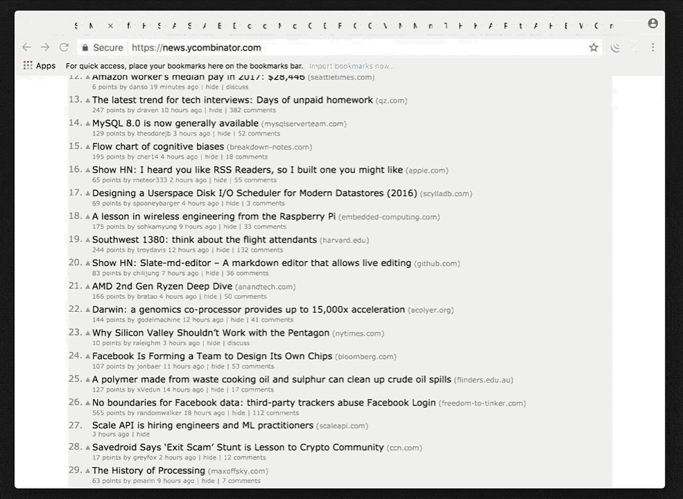

The missing chrome extension for busy developers. Swoop brings modern code editor's quick open functionality to your browser.


## Install

* [Chrome Extension](https://chrome.google.com/webstore/detail/swoop-beta/hnjjjkipglinhabedpmnbimjolifcihd)
* Safari Extension (coming soon)


## How it works
**Default Shortucts:**
- Mac: <kbd>Command ⌘</kbd> + <kbd>K</kbd>
- Windows and Linux: <kbd>Ctrl</kbd> + <kbd>M</kbd>


## Customization

We're happy to receive suggestions and contributions, but be aware this is a highly opinionated project. There's a very high bar for adding options.

This doesn't necessarily limit you from manually disabling functionality that is not useful for you. You can clone the repository, make the adjustments you need, and [load the unpacked extension in Chrome](https://developer.chrome.com/extensions/getstarted#unpacked), rather than installing from the Chrome Store.

## Contribute

Suggestions and pull requests are highly encouraged!

The extension has two main components:
- an event page that holds the state and most of the logic.
- a content script injected into each tabs individually, that act as a UI.

In order to make modifications to the extension you'd need to run it locally.

Please follow the below steps:

```
git clone https://github.com/ndethore/swoop
cd swoop/chrome/content-script
npm install    # Install dev dependencies
npm run build  # Build the extension code so it's ready for the browser
npm run watch  # Listen for file changes and automatically rebuild
```

Once built, load it in the browser of your choice:

<table>
	<tr>
		<th>Chrome</th>
		<th>Safari</th>
	</tr>
	<tr>
		<td width="50%">
			<ol>
				<li>Open <code>chrome://extensions</code>
				<li>Check the <strong>Developer mode</strong> checkbox
				<li>Click on the <strong>Load unpacked extension</strong> button
				<li>Select the folder <code>swoop/chrome</code>
			</ol>
		</td>
		<td width="50%" style="text-align: center;">
			Coming soon
		</td>
	</tr>
</table>


## Maintainers

* [Nicolas de Thore](https://github.com/ndethore)


## License

[MIT](https://github.com/ndethore/swoop/blob/master/LICENSE)

Copyright (c) 2018-present, Nicolas de Thoré.
